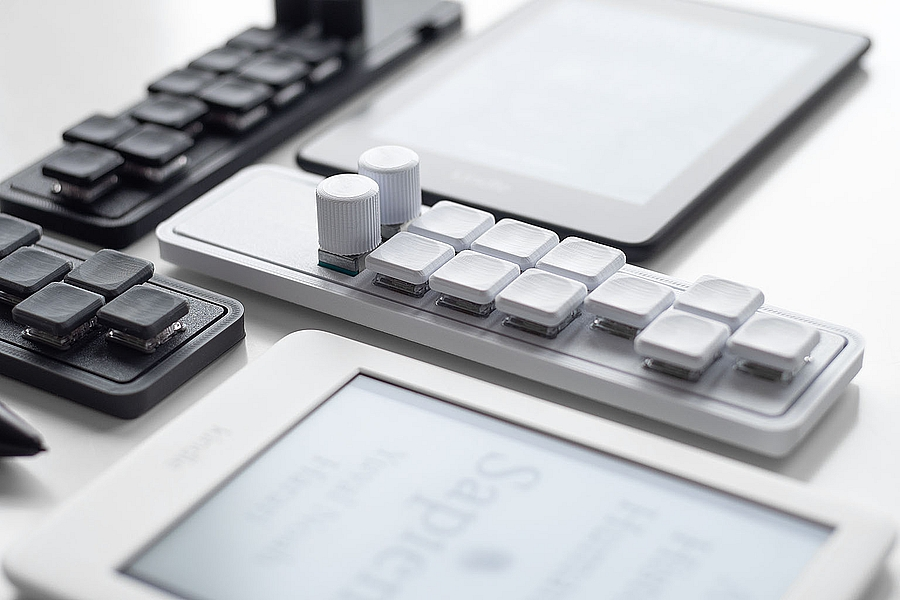

# Palette Macropad
Palette is a low-profile, fully-programmable macropad with 10-keys and dual encoder knobs.

# Features

- PLA Pro 3D printed case, switchplate, encoder knobs and keycaps (Ready to Go version)
- hotswap sockets compatible with Kailh Choc V1 switches
- low-profile Kailh Choc Pink linear switches (preinstalled in Ready To Go)
- integrated rubber case feet
- VIAL firmware (preflashed) and QMK firmware-compatible, RP2040 MCU
- runs on Windows, Linux or mac OS

# Firmware
- VIAL default firmware:
[escobytekeyboards_palette_vial.uf2](https://github.com/escobytekeyboards/Palette/blob/main/escobytekeyboards_palette_vial.uf2)

- QMK:
[escobytekeyboards_palette_default.uf2](https://github.com/escobytekeyboards/Palette/blob/main/escobytekeyboards_palette_default.uf2)
